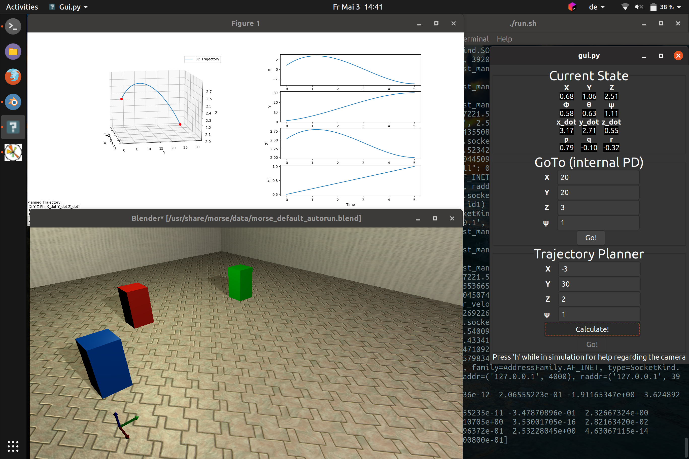

# MAVeric
MAVeric is a simulation for quadrotors (and in particular "micro air vehicles" = MAVs) that incorporates a GUI to show all current state variables and control the MAV via the internal PD controller.
Furthermore, minimum snap trajectories can be generated, visualized and directly followed by the MAV through the GUI.
The logic behind this is largely based on 

[1] C. Richter, A. Bry, and N. Roy, “**Polynomial trajectory planning for aggressive quadrotor flight in dense indoor environments,**” in *International Journal of Robotics Research*, Springer, 2016.

and

[2] D. Mellinger and V. Kumar, "**Minimum snap trajectory generation and control for quadrotors,**" 2011 IEEE International Conference on Robotics and Automation, Shanghai, 2011, pp. 2520-2525.

## Examplary Overview


## Installation
**This installation is written for Ubuntu 18.04, but it should work on other versions or even OSs without much hassle.**
A running version of *Python3* is expected.

### Clone this repository
```
git clone git@github.com:Peyje/MAVeric.git
cd MAVeric
```

### Installing the Morse simulator
```
sudo apt install morse-simulator
```

### Install dependencies
```
sudo apt install cython3 python3-pip python3-tk
```

### Install Python requirements
```
pip3 install -r requirements.txt
```

### Initialize the morse simulation
```
morse create simulation
```
Be sure to be in the directory `MAVeric/` while doing this! You can **ignore the error message** "directory already exists". Morse tried to set up a simple first scene, but the needed simulation files are already there.

## Running the simulation
Simply type
```
./run.sh
```
to launch both the simulation and the GUI.

The GUI will automatically start 3 seconds after starting the script as it needs to connect to the fully initalized simulation. If the simulation does not start up fast enough for you, simply change this 3 seconds to some arbitrary higher number. 
