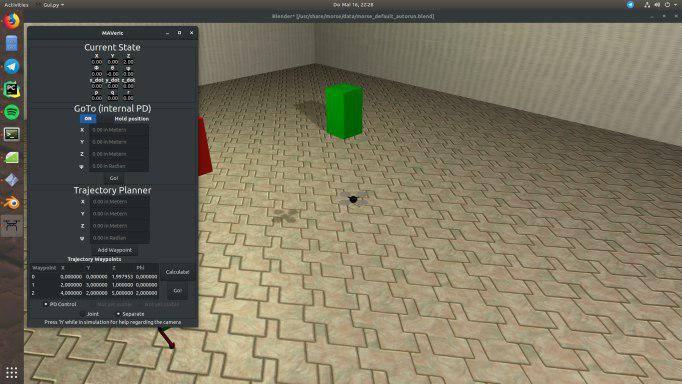
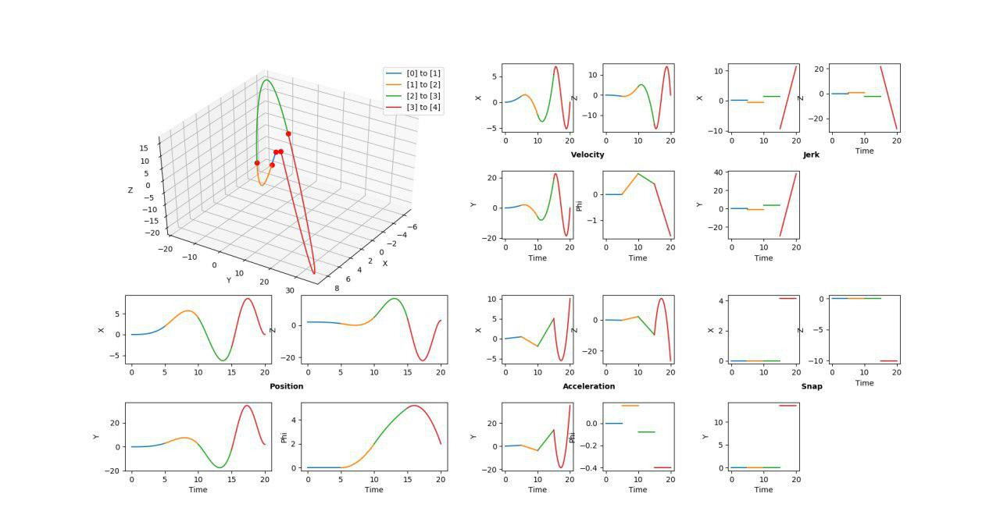

# MAVeric
MAVeric is a simulation for quadrotors (and in particular "micro air vehicles" = MAVs) that incorporates a GUI to show all current state variables and control the MAV via the default PD controller. 
Furthermore, minimum snap trajectories can be generated, visualized and directly followed by the MAV through the GUI.
The logic behind this is largely based on 

[1] C. Richter, A. Bry, and N. Roy, “**Polynomial trajectory planning for aggressive quadrotor flight in dense indoor environments,**” in *International Journal of Robotics Research*, Springer, 2016.

and

[2] D. Mellinger and V. Kumar, "**Minimum snap trajectory generation and control for quadrotors,**" 2011 IEEE International Conference on Robotics and Automation, Shanghai, 2011, pp. 2520-2525.

## Examplary Overview



## Work in Progress!
This currently still is a work in progress! Please take a look at the issue page to see what likely will be implemented in the next few days to weeks.

## Installation
**This installation is written for Ubuntu 18.04, but it should work on other versions or even OSs without much hassle.**
A running version of *Python3* is expected.

### Clone this repository
```
git clone git@github.com:Peyje/MAVeric.git
cd MAVeric
```

### Installing the Morse simulator
```
sudo apt install morse-simulator
```

### Install dependencies
```
sudo apt install cython3 python3-pip python3-tk
```

### Install Python requirements
```
pip3 install -r requirements.txt
```

### Initialize the morse simulation
```
morse create simulation
```
Be sure to be in the directory `MAVeric/` while doing this! You can **ignore the error message** "directory already exists". Morse tried to set up a simple first scene, but the needed simulation files are already there.

## Running the simulation
Simply type
```
./run.sh
```
to launch both the simulation and the GUI.

The GUI will automatically start 3 seconds after starting the script as it needs to connect to the fully initalized simulation. If the simulation does not start up fast enough for you, simply change this 3 seconds to some arbitrary higher number. 

The GUI will update the state values every 50ms and display them. Every point in space can be set as a waypoint and the default MORSE PD controller will fly to that point and try to hold its position. This position holding can be turned off and on directly in the GUI as well.

A minimum snap trajectory can also be calculated from the current position to the position entered in the corresponding input fields. After clicking *Calculate* the trajectory will be plotted. By closing this window and clicking *Go* the trajactory will be followed by the MAV with use of the selected controller.

## Overview
This will give the reader a brief overview over the whole project.

### run.sh
This simple shell script starts up the simulation as well as starting the GUI with a short time delay, so the simulation is up and running by then.

### Morse simulation
All needed data for the simulation (without GUI) is stored in the *simulation* folder. Some actuators and sensors have been edited and extended from the default components of MORSE. *default.py* sets up the scene and starts everything regarding the simulation.
This alone can be run by runnging the follwing command in a terminal:
```
morse run simulation
```

### gui.py
This file is the "main file" of this project. While a simulation can be run by itself (as mentioned above), the running of this file will start up the GUI and therefore the constant updating of the state values. All other features can be started and controlled exclusively through this GUI. 

After setting up the GUI it will also connect to the simulation with use of telnet. A *current_state* object will store all state values. A *bridge* object will take care of the constant updating of values. A *Handler* class will connect the buttons and input fields with the corresponding functions. If a trajectory is calculated a *trajectory* object will be generated. If a trajectory is actively followed, this trajectory will be sent to a *control* object that calculates the next step and return that to be communicated by the *bridge* object to the simulation.

### trajectory_planner.py
This file holds a static function to calculate a minimum snap trajectory with a QP. It is invoked by the *gui.py*.

### draw.py
This file holds a static function to plot and visualize a trajectory. It is invoked by the *trajectory_planner.py* after successfully calculating a trajectory.

### control.py
This file will be invoked by the GUI after a trajectory has been calculated and is to be followed. It will be initiated with this trajectory and calculate the inputs for different controllers used by the simulation.

### layout.glade
The layout of the GUI, constructed by using the Glade editor.
